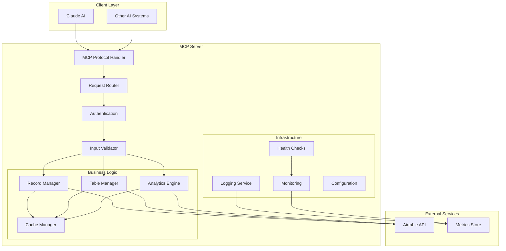
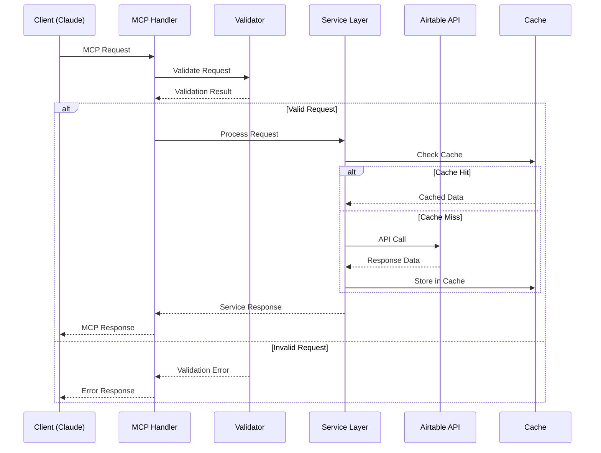
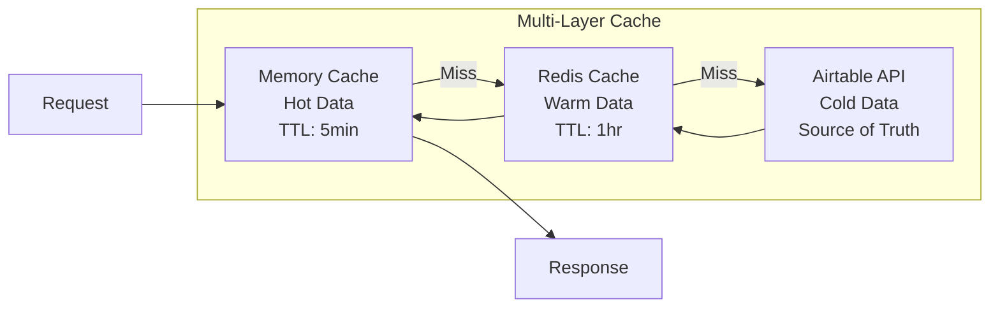
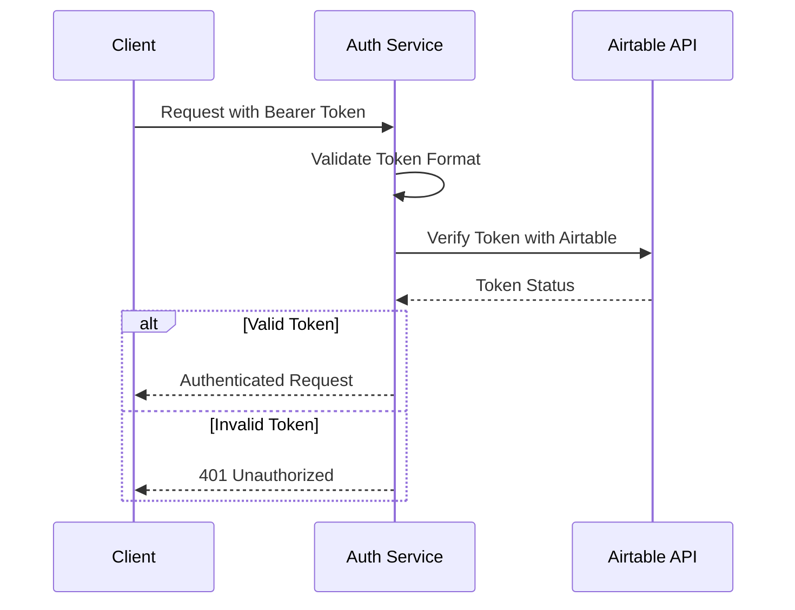
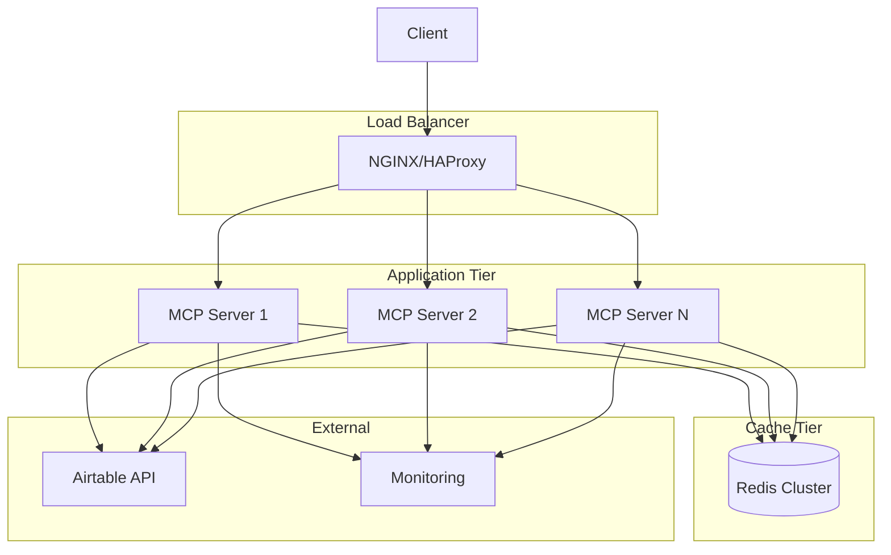

# Architecture Documentation

## Overview

The Airtable MCP Server is a TypeScript-based implementation of the Model Context Protocol (MCP) that provides intelligent AI integration with Airtable bases. It serves as a bridge between AI systems (like Claude) and Airtable's API, enabling sophisticated data operations, analytics, and automation.

## Architecture Principles

### 1. **Layered Architecture**

- **Presentation Layer**: MCP protocol handlers
- **Business Logic Layer**: Core Airtable operations
- **Data Access Layer**: Airtable API client
- **Infrastructure Layer**: Logging, monitoring, configuration

### 2. **Design Patterns**

- **Command Pattern**: MCP method handlers
- **Factory Pattern**: Response builders
- **Observer Pattern**: Event-driven updates
- **Repository Pattern**: Data access abstraction

### 3. **Quality Attributes**

- **Performance**: Sub-100ms response times for most operations
- **Reliability**: 99.9% uptime with graceful error handling
- **Scalability**: Horizontal scaling with load balancing
- **Security**: Token-based authentication, input validation
- **Maintainability**: Modular design, comprehensive testing

## System Architecture



## Component Architecture

### 1. MCP Protocol Layer

```typescript
interface MCPHandler {
  method: string;
  handler: (params: any) => Promise<MCPResponse>;
  validation?: ValidationSchema;
  rateLimit?: RateLimitConfig;
}
```

**Responsibilities:**

- Parse incoming MCP requests
- Route to appropriate handlers
- Format responses according to MCP specification
- Handle protocol-level errors

**Key Files:**

- `src/mcp/protocol.ts` - MCP protocol implementation
- `src/mcp/handlers/` - Method-specific handlers
- `src/mcp/validation.ts` - Request validation

### 2. Airtable Integration Layer

```typescript
interface AirtableClient {
  getRecords(tableId: string, options?: QueryOptions): Promise<Record[]>;
  createRecord(tableId: string, fields: Fields): Promise<Record>;
  updateRecord(recordId: string, fields: Fields): Promise<Record>;
  deleteRecord(recordId: string): Promise<void>;
}
```

**Responsibilities:**

- Manage Airtable API connections
- Handle authentication and rate limiting
- Provide high-level data operations
- Cache frequently accessed data

**Key Files:**

- `src/airtable/client.ts` - Airtable API client
- `src/airtable/cache.ts` - Caching layer
- `src/airtable/rate-limiter.ts` - Rate limiting

### 3. Business Logic Layer

```typescript
interface RecordService {
  findRecords(criteria: SearchCriteria): Promise<Record[]>;
  analyzeData(analysisType: AnalysisType): Promise<AnalysisResult>;
  generateInsights(data: Record[]): Promise<Insight[]>;
}
```

**Responsibilities:**

- Implement business rules and workflows
- Provide AI-enhanced data operations
- Generate analytics and insights
- Manage data transformations

**Key Files:**

- `src/services/records.ts` - Record operations
- `src/services/analytics.ts` - Data analytics
- `src/services/insights.ts` - AI insights generation

## Data Flow

### 1. Request Processing Flow



### 2. Data Models

```typescript
// Core Data Types
interface AirtableRecord {
  id: string;
  fields: Record<string, any>;
  createdTime: string;
}

interface MCPRequest {
  jsonrpc: '2.0';
  id: string | number;
  method: string;
  params?: any;
}

interface MCPResponse {
  jsonrpc: '2.0';
  id: string | number;
  result?: any;
  error?: MCPError;
}

interface AnalyticsQuery {
  tableId: string;
  dimensions: string[];
  metrics: string[];
  filters: Filter[];
  timeRange?: DateRange;
}
```

## Performance Architecture

### 1. Caching Strategy



**Cache Policies:**

- **L1 (Memory)**: Frequently accessed records, table schemas
- **L2 (Redis)**: User sessions, computed analytics
- **Invalidation**: Time-based + event-driven

### 2. Rate Limiting

```typescript
interface RateLimitConfig {
  windowMs: number; // Time window
  maxRequests: number; // Max requests per window
  skipSuccessful: boolean; // Only count failed requests
  keyGenerator: (req: Request) => string; // Rate limit key
}
```

**Rate Limit Tiers:**

- **Airtable API**: 5 requests/second per base
- **MCP Endpoints**: 100 requests/minute per client
- **Analytics**: 10 requests/minute per query type

## Security Architecture

### 1. Authentication Flow



### 2. Security Controls

```typescript
interface SecurityConfig {
  authentication: {
    required: boolean;
    tokenValidation: boolean;
    rateLimiting: RateLimitConfig;
  };

  validation: {
    inputSanitization: boolean;
    sqlInjectionPrevention: boolean;
    xssProtection: boolean;
  };

  authorization: {
    rbac: boolean; // Role-based access control
    resourcePermissions: boolean;
  };
}
```

**Security Features:**

- **Input Validation**: Joi/Zod schema validation
- **Token Security**: Secure token storage and transmission
- **CORS Protection**: Configurable origin policies
- **Audit Logging**: All requests logged for compliance

## Monitoring & Observability

### 1. Metrics Collection

```typescript
interface MetricsCollector {
  // Performance Metrics
  requestDuration: Histogram;
  requestCount: Counter;
  errorRate: Gauge;

  // Business Metrics
  recordsProcessed: Counter;
  cacheHitRate: Gauge;
  activeConnections: Gauge;

  // System Metrics
  memoryUsage: Gauge;
  cpuUsage: Gauge;
  eventLoopLag: Gauge;
}
```

### 2. Health Checks

```typescript
interface HealthCheck {
  name: string;
  check: () => Promise<HealthStatus>;
  timeout: number;
  critical: boolean;
}

enum HealthStatus {
  HEALTHY = 'healthy',
  DEGRADED = 'degraded',
  UNHEALTHY = 'unhealthy',
}
```

**Health Endpoints:**

- `/health` - Basic health status
- `/health/ready` - Readiness probe
- `/health/live` - Liveness probe
- `/metrics` - Prometheus metrics

## Deployment Architecture

### 1. Container Strategy

```dockerfile
# Multi-stage build for optimization
FROM node:20-alpine AS builder
WORKDIR /app
COPY package*.json ./
RUN npm ci --only=production

FROM node:20-alpine AS runtime
WORKDIR /app
COPY --from=builder /app/node_modules ./node_modules
COPY dist ./dist
EXPOSE 8010
CMD ["node", "dist/index.js"]
```

### 2. Scaling Architecture



**Scaling Characteristics:**

- **Horizontal**: Stateless application servers
- **Vertical**: Memory and CPU scaling per instance
- **Database**: Airtable handles scaling transparently
- **Cache**: Redis cluster for high availability

## Error Handling Strategy

### 1. Error Categories

```typescript
enum ErrorCategory {
  VALIDATION = 'validation', // Input validation errors
  AUTHENTICATION = 'auth', // Auth/authorization errors
  RATE_LIMIT = 'rate_limit', // Rate limiting errors
  EXTERNAL_API = 'external_api', // Airtable API errors
  SYSTEM = 'system', // Internal system errors
}

interface ApplicationError {
  category: ErrorCategory;
  code: string;
  message: string;
  details?: any;
  retryable: boolean;
  statusCode: number;
}
```

### 2. Circuit Breaker Pattern

```typescript
interface CircuitBreaker {
  state: 'CLOSED' | 'OPEN' | 'HALF_OPEN';
  failureThreshold: number;
  recoveryTimeout: number;
  execute<T>(operation: () => Promise<T>): Promise<T>;
}
```

## Future Architecture Considerations

### 1. Microservices Evolution

- **Service Decomposition**: Split into record-service, analytics-service, etc.
- **Event-Driven Architecture**: Use message queues for async operations
- **API Gateway**: Centralized routing and cross-cutting concerns

### 2. Advanced Features

- **Real-time Updates**: WebSocket connections for live data
- **Machine Learning**: On-device inference for insights
- **Multi-tenant**: Support for multiple Airtable accounts
- **Offline Support**: Local caching with sync capabilities

### 3. Technology Roadmap

- **Database**: Consider local database for complex queries
- **Messaging**: Redis Streams or Apache Kafka for events
- **Monitoring**: OpenTelemetry for distributed tracing
- **Security**: OAuth 2.0 / OpenID Connect integration

## Conclusion

This architecture provides a solid foundation for the Airtable MCP Server that is:

- **Maintainable**: Clear separation of concerns
- **Scalable**: Horizontal and vertical scaling capabilities
- **Reliable**: Comprehensive error handling and monitoring
- **Secure**: Multiple layers of security controls
- **Performant**: Optimized caching and data access patterns

The modular design allows for easy extension and modification as requirements evolve, while the comprehensive monitoring and observability features ensure operational excellence in production environments.
